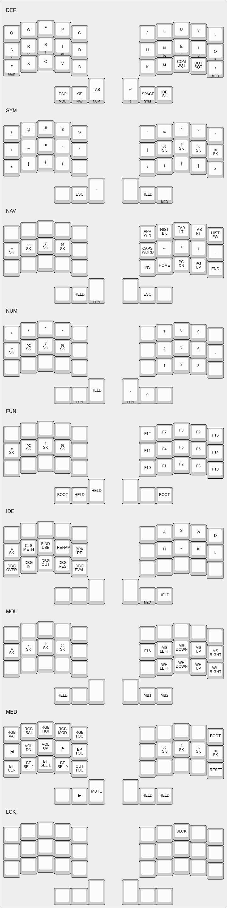

# zmk-config

This is a [ZMK](https://zmk.dev) config repo for my wireless mechanical keyboards.

Also see my [QMK userspace](https://github.com/jbarr21/qmk_userspace/) for equivalent keymap definitions for QMK.

Build with Docker:
```sh
docker run -it --rm -w="/zmk" \
    -v $(realpath .):/zmk-config \
    -v $(realpath ../zmk):/zmk \
    zmkfirmware/zmk-dev-arm:3.2-branch /bin/bash

west init -l app/ \
    && west update \
    && west zephyr-export \
    && pip3 install --user -r zephyr/scripts/requirements-base.txt

west build -s app -b nice_nano_v2 -- -DZMK_CONFIG=/zmk-config/config -DSHIELD=ffkb
```


